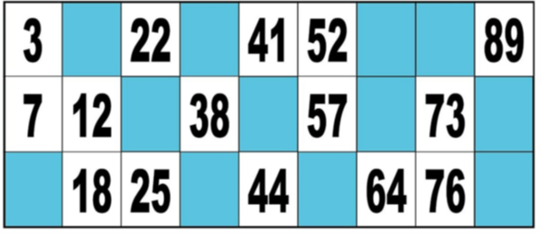
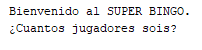
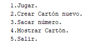
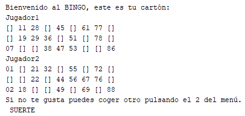
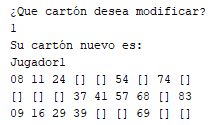
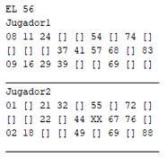
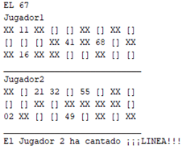
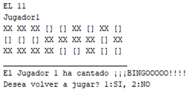
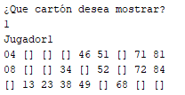
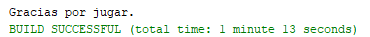

# Bingo
## Especificaciones.
Creación del juego del bingo donde el bombo será el ordenador. Sacará números aleatorios (hasta el 90 que es el máximo de números). Una partida consiste en extraer las bolas del bombo al azar y cantar su respectiva numeración. El programa tiene que ser capaz de validar si el número cantado se encuentra en el cartón de cada jugador y “tacharlo”.
Al completar una línea horizontal en un cartón, el programa deberá mostrar "línea". Cuando se consigue tachar todos los números del cartón, se tendrá que mostrar "bingo" y se dará opción de jugar otra partida o abandonar el programa.
Además, generará los cartones en base a las siguientes normas.  
  
## Normas.
•	Los cartones estarán formados por números aleatorios.
•	9 columnas, en la primera de ellas hay números del 1 al 9, en la segunda del 10 al 19, en la tercera del 20 al 29, así sucesivamente.
•	Tienen 3 filas.
•	 El total de números del cartón serán 15 y el resto (casillas azules) serán casillas vacías (se puede representar con ceros, asteriscos, XX, etc.)
•	 Por cada fila hay 5 números.
El programa contará con un menú:
Preguntará el número de jugadores que habrá en la partida.
1. Jugar.  Generará un cartón para cada jugador, con la disposición de los números y posiciones vacías/nulas aleatorias, máximo 2 números por columna, mínimo 1 número por columna) y los mostrará por pantalla.
2. Generar cartón nuevo. Para el jugador que se quiera seleccionar. Dejará modificar cualquiera de los cartones siempre y cuando no se hayan extraído ya bolas del bombo y haya comenzado el Bingo. En caso de que haya comenzado el juego se mostrará un aviso y se impedirá cambiar el cartón.
3. Sacar números del bombo. Se sacará un número aleatorio del 1 al 90, no podrán salir varias veces el mismo número ya que semejan las bolas de un bombo real. Además, se mostrarán todos los cartones de los jugadores con los valores que ya han salido tachados. Aparecerá un aviso para el primer jugador que cante Línea, y un aviso para el primer jugador que cante Bingo. Una vez se cante bingo se permitirá decidir al jugador si desea volver a jugar o finalizar el juego.
4. Mostrar Cartón. Permite visualizar en pantalla el cartón del jugador que deseemos para ver su progreso.
5. Salir. Aparece un mensaje de despedida y sale del juego.
# MANUAL DE USUARIO
En primer lugar, se ejecuta el programa. Pedirá el número de jugadores que van a jugar al juego del bingo.  
   
Una vez se haya facilitado dicha información aparecerá el menú del juego.  
    
1. Jugar.  Generará un cartón para cada jugador.  
    
2. Generar cartón nuevo. Para el jugador que se quiera seleccionar. Creará un nuevo cartón de juego para el jugador que se desee siempre y cuando no se hayan extraído ya bolas del bombo y haya comenzado el Bingo.   
    
3. Sacar números del bombo. Se deberá pulsar esta opción del menú para que se extraiga un número nuevo del bombo. Se mostrarán todos los cartones de los jugadores con los valores que ya han salido tachados. Aparecerá un aviso para el primer jugador que cante Línea, y un aviso para el primer jugador que cante Bingo. Una vez se cante bingo se permitirá decidir al jugador si desea volver a jugar o finalizar el juego.  

  
  
4. Mostrar Cartón. Permite visualizar en pantalla el cartón del jugador que se desee.  
  
5. Salir. Para salir del juego.  
   
